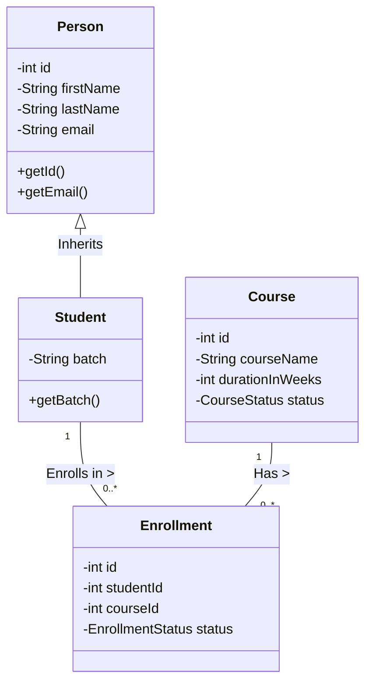

Here is the updated `README.md` with a clear, professional structure and the requested **Class Diagram** (using Mermaid syntax, which renders automatically on GitHub).

You can copy-paste the code below directly into your `README.md` file.

```markdown
# LearnTrack - Student & Course Management System

**LearnTrack** is a Java-based console application designed to demonstrate core Object-Oriented Programming (OOP) principles. It manages the lifecycle of students, courses, and enrollments using a layered architecture without an external database.

---

## 🏗️ Class Diagram
The following diagram illustrates the relationships between the core Entities and the inheritance hierarchy used in the system.



> *Note: This diagram is rendered using Mermaid.js, supported natively by GitHub.*

---

## 🚀 Key Features

* **OOP Principles**: Demonstrates Inheritance (`Student` extends `Person`), Encapsulation (Private fields), and Polymorphism.
* **Layered Architecture**: Strict separation of concerns:
* **Entity Layer**: Data models.
* **Repository Layer**: In-memory storage (ArrayLists).
* **Service Layer**: Business logic and validation.
* **UI Layer**: Console-based menu system.


* **Data Integrity**: Includes validation for empty inputs and custom exceptions (`EntityNotFoundException`).

---

## 📂 Project Structure

```text
src/com/airtribe/learntrack/
├── Main.java               // Application Entry Point
├── entity/                 // Data Models
│   ├── Person.java
│   ├── Student.java
│   └── Course.java
├── service/                // Business Logic
├── repository/             // Data Storage (ArrayLists)
├── util/                   // Utilities (ID Generators)
└── exception/              // Custom Exceptions

```

---

## 💻 How to Run

1. **Clone the Repository**
```bash
git clone [https://github.com/Cutiedeepti11/learntrack.git](https://github.com/Cutiedeepti11/learntrack.git)
cd learntrack

```


2. **Compile the Project**
```bash
cd src
javac com/airtribe/learntrack/Main.java

```


3. **Run the Application**
```bash
java com.airtribe.learntrack.Main

```


---

## 🛠️ Tech Stack

* **Java**: Core Java (JDK 8+)
* **Build System**: Manual / Javac
* **Version Control**: Git & GitHub

---

## 📝 Design Decisions

1. **Inheritance**: We created a `Person` base class to hold common attributes (`name`, `email`) shared by `Student` (and potentially future `Trainer` classes), reducing code duplication.
2. **Repository Pattern**: Even without a real database, we used Repository classes to handle `ArrayList` operations. This makes it easier to swap in a real SQL database later without rewriting the whole app.

```

```
